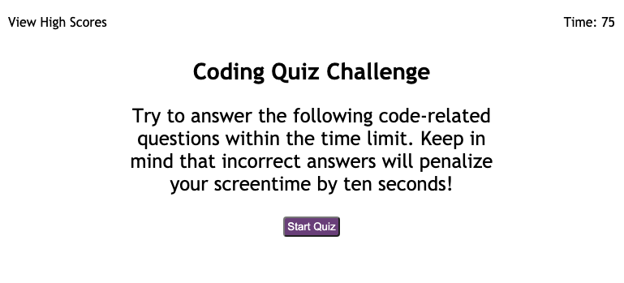

# Challenge 4: Web APIs Code Quiz

## Description
A timed coding quiz with multiple-choice questions. This app runs in the browser and features dynamically updated HTML and CSS and is powered by JavaScript.

Done as a challenge for UoT's Coding Bootcamp.

## Talbe of Contents
* [Usage](#usage)
* [Links](#links)
* [Tools](#tools)
* [Credits](#credits)
* [Challenge Guidelines](#challenge-guidelines)

## Usage
To test knowledge on JavaScript fundamentals.

## Links
### Deployed Quiz:
* [Quiz](https://shannonnell.github.io/UoT-coding-challenge-4/)

### Links that helped:
* [LocalStorage Guide](https://blog.logrocket.com/localstorage-javascript-complete-guide/#clear)
* [LocalStorage Youtube](https://www.youtube.com/watch?v=DFhmNLKwwGw)

## Tools
* HTML 
* CSS
* JavaScript

## Credits
* Completed by: [Nell - GitHub](https://github.com/ShannonNell)

## Challenge Guidelines
### Task:
Application wherein a user can take a timed quiz on JavaScript fundamentals and store the high scores.

### Criteria: 
* WHEN click start, THEN timer starts and first question appears
* WHEN answer question, THEN presented with another question
* WHEN answer question incorrectly, THEN time subtracted from the clock
* WHEN questions answered or time at 0, THEN game over
* WHEN game over, THEN can save initials and score
* Dynamically created HTML and CSS using JavaScript
